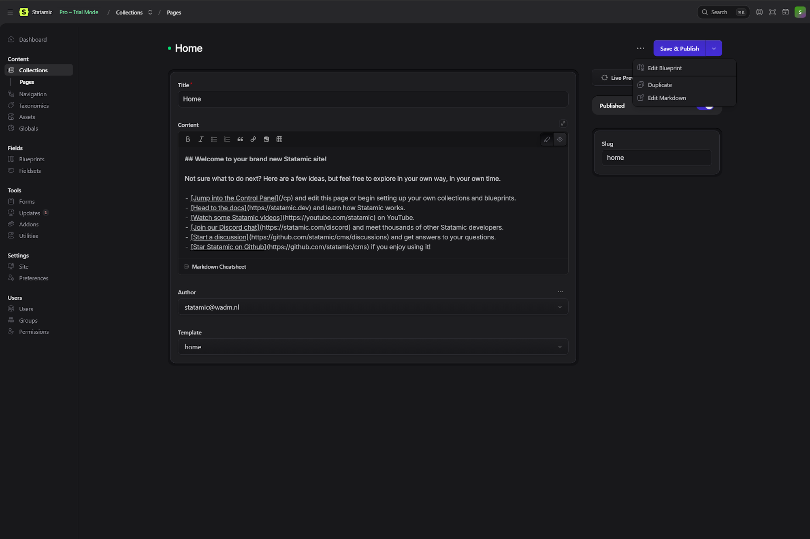
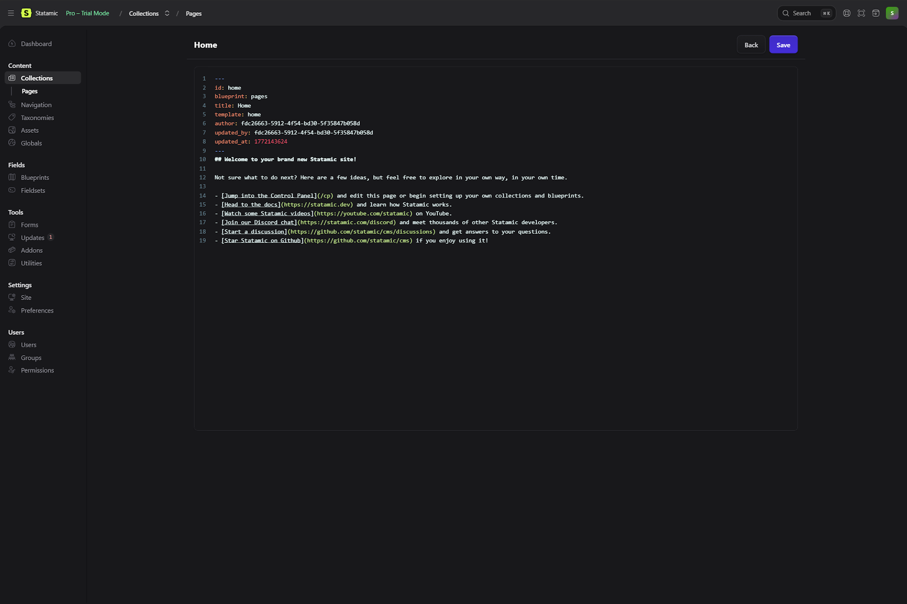

# MD Editor for Statamic

Provides a built-in MD editor view for entries, letting you modify the underlying content file without leaving the control panel.

---

## Features

- **Raw file editing** — read and write the actual `.md` file on disk, bypassing Statamic's field processing
- **YAML front matter support** — the editor uses `yaml-frontmatter` mode, so both YAML and Markdown are syntax-highlighted correctly
- **CodeMirror editor** — line numbers, line wrapping, and 2-space indentation out of the box
- **Entry action integration** — accessible via the "Edit Markdown" action in any entry listing
- **Quick save** — writes directly to disk and shows a toast notification on success or error
- **Navigates seamlessly** — back button returns you to the standard entry editor

---

## Requirements

- PHP 8.1+
- Statamic 6.0+

---

## Installation

Install via Composer:

```bash
composer require kwijkniet/md-editor
```

That's it. No publishing, no configuration — the addon registers itself automatically.

---

## Usage

1. Open any collection in the Statamic control panel.
2. Hover over an entry and open the **Actions** menu (the `⋮` or kebab menu).
3. Click **Edit Markdown**.



4. You are taken to a full-screen CodeMirror editor showing the raw `.md` file, including YAML front matter.



5. Make your changes and click **Save**. The file is written directly to disk.

---

## How It Works

The addon registers two CP routes:

| Method  | Path                                                        | Description              |
|---------|-------------------------------------------------------------|--------------------------|
| `GET`   | `/cp/collections/{collection}/entries/{entry}/markdown`     | Renders the editor view  |
| `PATCH` | `/cp/collections/{collection}/entries/{entry}/markdown`     | Saves the raw file       |

On `GET`, the controller reads the entry's `.md` file with `file_get_contents()` and passes the raw content to a Vue component via Inertia. On `PATCH`, the submitted raw content is written back with `file_put_contents()`.

The JavaScript registers an Inertia page component (`MdEditor`) that wraps Statamic's built-in `<ui-code-editor>` with `yaml-frontmatter` mode.

---

## Notes

- **Bypasses Statamic's content pipeline.** Saving through this editor writes raw bytes to disk. Statamic's field validation, augmentation, and revision history are not triggered.
- **Permissions** — the action is authorized for all authenticated CP users. If you need to restrict access, override `authorize()` in `EditMarkdown.php`.
- Use with care on production entries if you rely on Statamic's revision system, as raw saves will not create revisions.

---

## License

MIT
